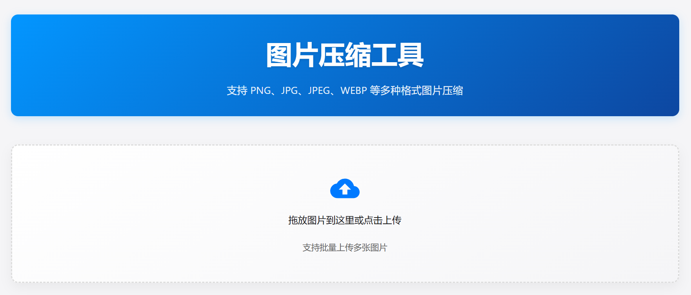
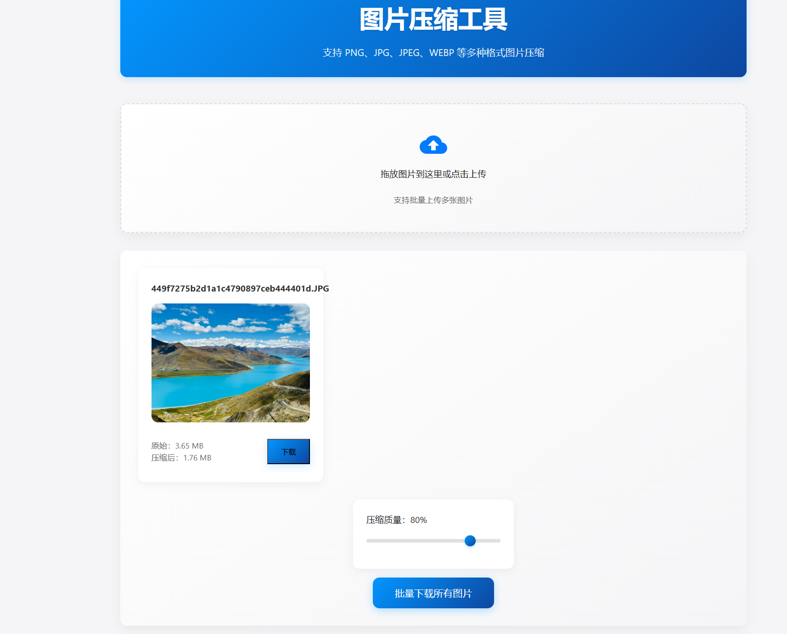
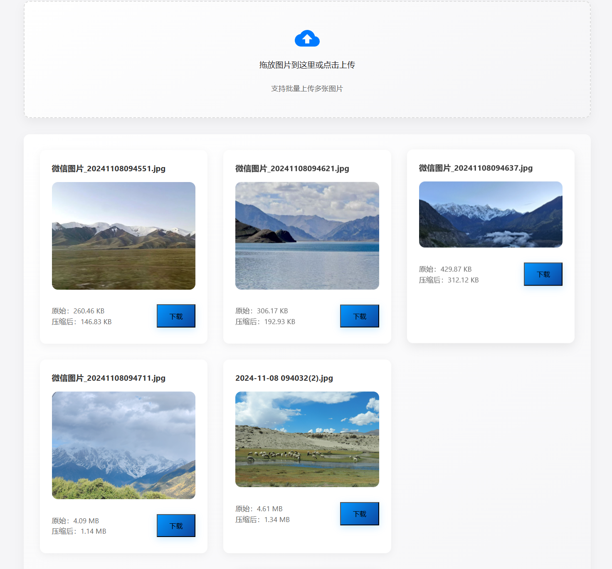

# 图片压缩工具

一个简单易用的在线图片压缩工具，支持批量处理多张图片，具有现代化的界面设计和流畅的用户体验。

## 功能特点

- 🖼️ 支持多种图片格式（PNG、JPG、JPEG、WEBP 等）
- 📦 批量上传和处理多张图片
- 🎚️ 可调节压缩质量

- 👀 实时预览压缩效果
- 📊 显示压缩前后的文件大小对比
- 💾 支持单张/批量下载压缩后的图片
- 📱 响应式设计，支持移动端使用 

## 本地部署
1. 克隆项目 
2. 直接打开 index.html 文件，或使用本地服务器运行
3. 在浏览器中访问

## 使用说明

1. **上传图片**
   - 点击上传区域选择图片
   - 或直接将图片拖放到上传区域
   - 支持同时选择多张图片

2. **调整压缩质量**
   - 使用滑块调节压缩质量（1-100）
   - 数值越高，图片质量越好，文件越大
   - 数值越低，压缩率越高，文件越小

3. **预览和下载**
   - 实时预览压缩效果
   - 查看压缩前后的文件大小
   - 点击单个图片下的"下载"按钮下载单张图片
   - 点击"批量下载所有图片"下载所有处理后的图片

## 使用示例

### 场景一：压缩单张图片
1. 点击上传区域
2. 选择一张需要压缩的图片
3. 通过滑块调整压缩质量，找到合适的平衡点
4. 点击"下载"保存压缩后的图片

### 场景二：批量处理多张图片
1. 选择多张图片或直接拖放到上传区域
2. 调整压缩质量
3. 可以单独下载某张图片，或使用"批量下载所有图片"按钮一次性下载所有图片

## 技术栈

- HTML5
- CSS3
- JavaScript (原生)
- Canvas API

## 浏览器支持

- Chrome (推荐)
- Firefox
- Safari
- Edge
- Opera

## 注意事项

- 建议上传图片大小不超过 10MB
- 压缩是在浏览器中进行的，不会上传到服务器
- 处理大图片时可能需要等待几秒钟
- 批量下载时部分浏览器可能会阻止多文件下载，需要允许权限
